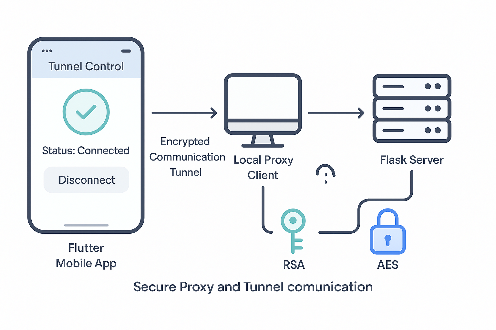

# Secure-Proxying-Forwarding-using-Asymmetric-Encryption
A client-server app that can securely forward TCP communication over the internet using asymmetric encryption.

# Goal

Mimicking something like a very minimal VPN or HTTPS-like tunneling, manually:

- Using public key cryptography

- Encrypting payloads both ways

- Not relying on TLS or certs — all done in Python 

# What Is Asymmetric Encryption?

Asymmetric encryption uses two keys:

- Public Key (shareable) — used to encrypt

- Private Key (secret) — used to decrypt

In the tunnel:

- Client encrypts the data using the server’s public key

- Server decrypts it using its private key

- This keeps data safe even if someone sniffs the traffic — they can't decrypt it without the private key.

# Hybrid Encryption Flow
AES is used for encrypting the main data (fast + secure).

RSA is used to encrypt the AES key (secure key exchange).

- The client sends:

RSA_ENCRYPTED_AES_KEY || AES_ENCRYPTED_DATA

- The server:

Extracts and decrypts the AES key using RSA.

Decrypts the rest of the data using AES.

# Generally

1. Client connects to listening server ✔️

2. Sent its public key to the server ✔️

3. Sent an encrypted HTTP request (GET / HTTP/1.1 ...) ✔️

4. Server decrypted the request with client public key ✔️

5. Server fetched the actual HTTP page (from example.com) ✔️

6. Server encrypted that page with the client’s public key ✔️

7. Client received encrypted chunks, decrypted them locally, and print the final page ✔️

## Usage

Run it once:

1. Generate keys: At the root of the project, run `PYTHONPATH=. python3 keys/generate_keys.py`

You’ll get:

keys/private_key.pem

keys/public_key.pem

# Start server and client:

1. Run server: At the root of the project, run `PYTHONPATH=. python3 server/main.py`
2. Run client: At the root of the project, run `python3 client/client.py`

- On closing the server, the content of example.com will be displayed in the terminal.

